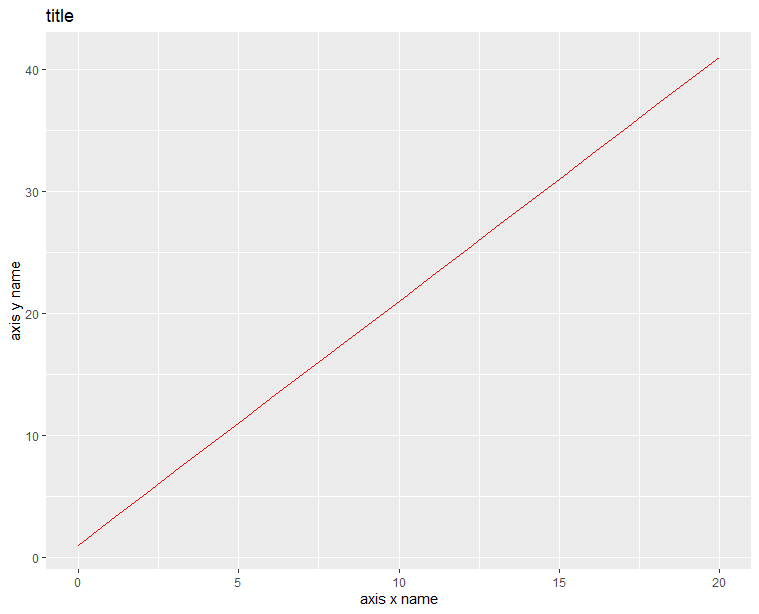
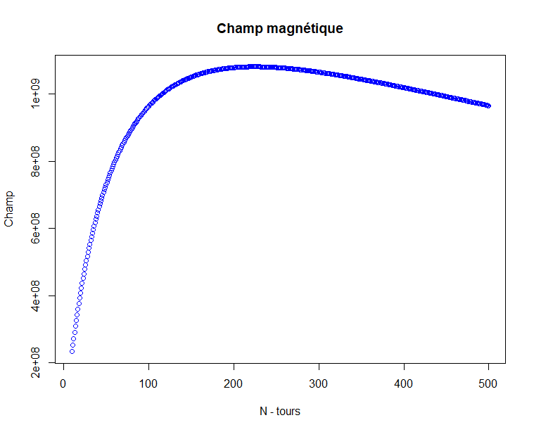
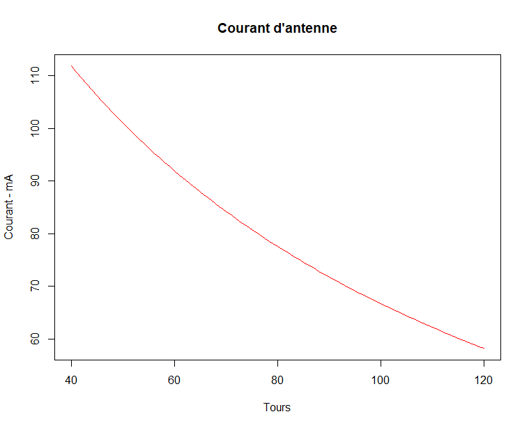
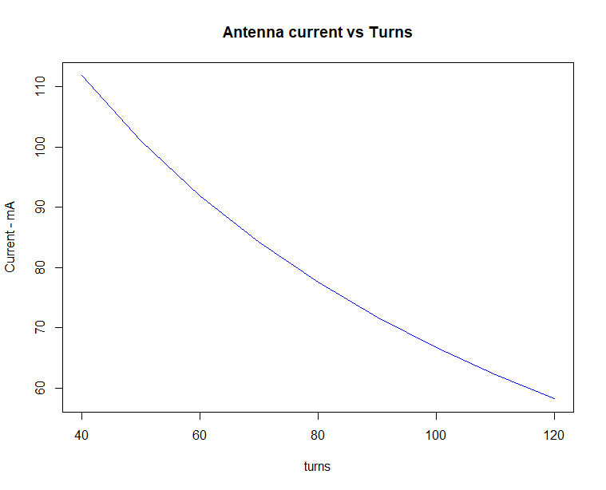

```{r, include = FALSE}
knitr::opts_chunk$set(
  collapse = TRUE,
  comment = "#>"
)
```

```{r setup, include = FALSE}
library(ant125)
```
\newpage

# Introduction

Le package **ant125** présente un ensemble de fonctions pour faciliter la conception des antennes de lecteurs RFID 125kHz. Il permet d'estimer les paramètres de ces antennes sur la base d'analyses faites sur de simples relevés de mesures. Les principaux paramètres recherchés lors de la conception d'antenne RFID sont: 
````
 -le nombre de spires
 -l'inductance
 -la résistance
````


Le parckage **ant125** permet aussi de prévoir des pramètres tels que le courant et la tension d'antenne. 

La conception du package s'appuie sur un ensemble d'observation faites sur des antennes RFID 125khz ainsi que sur la théorique des circuits RLC. A cela s'ajoute une expérience de la technologie RFID qui s'étend sur plusieurs années de travaux. 

Le mode de conception traité par le package **ant125** s'appuie sur le tranceiver EM4095 de EM Microelectronic, un composant dédié au pilotage d'antenne de lecteur de badges 125kHz.

# Théorie

Pour lire un badge RFID, il est nécessaire de l'activer par un champ magnétique sinusoïdale de fréquence 125kHz. Ce champ est produit par une antenne composée d'une multitudes de spires. Une fois activé, le badge va moduler cette porteuse activatrice afin de transmettre un numéro d'identification selon un protocole propre aux caractéristiques de la puce contenue dans le badge. La modulation peut être d'amplitude ou de fréquence.\\
Ce principe simple laisse entendre que la qualité de la lecture de badge va reposer sur la qualité du champ magnétique activateur. On comprend alors le soin apporté à la conception de l'antenne du lecteur.\\
La production de la porteuse à la fréquence de 125kHz repose sur un circuit RLC conçu pour une fréquence de résonnance de 125kHz.La théorie de ces circuit nous apprend que cette fréquence de résonnance dépend de la valeur de l'inductance d'antenne ainsi que de la valeur du condensateur d'accord. La fréquence de résonnance est donnée par la célébre relation:

  $$F = \frac{1}{2 \pi \sqrt{LC}}$$
 

où L est l'inductance de l'antenne et C la capacité d'accord associée.


La tension d'antenne est liée au factuer de qualité du système, lequel est défini de la façon suivante:


$$Q = \frac{2\pi F L}{R}$$
où F est la fréquence et R la résistance d'antennne

\newpage
# Présentation du tranceiver EM4095


Le transceiver EM4095 est le circuit qui pilote l'antenne et qui se charge de la démodulation.

## schéma de principe


Dans ce schéma, il faut noter:
````
- l'antenne La
- la capacité d'accord CRES
- le diviseur capacitif constitué de Cdv1 et Cdv2

````
Ces éléments entrerons dans l'estimation de l'antenne présentée plus loin.

Sur la base de ce schéma, on établit que le courant d'antenne est défini selon la relation suivante:


La tension d'antenne est donnée par la relation suivante: 


# Types de fonctions proposées

Le package **ant125** contient trois types de fonctions:
````
- les fonctions de calcul des estimateurs de paramètres
- les fonctions de représentation des données
- les fonctions de type script permettant de procéder à une analyse 
````
\newpage

# Recueil de mesures

Pour être exploitable dans le package, le recueil de mesures doit respecter la forme standard présentée ci-après:


 
 
 **Représentation des colonnes:**  
 
 echs: numéro d'échantillon
 N: nombre de spires de l'antenne  
 F: fréquence de mesures en kHz  
 L: inductance d'antenne mesurée en mH  
 R: résistance d'antenne mesurée en Ohms  
 
# Constantes du packages

Les constantes du package représentent des valeurs de composants du schéma de principe tels que:
````
- les capacités du pont capacitif
- la résistance série de limitation de courant d'antenne

````
ou des paramètres tels que :

````
- la fréquence de fonctionnement du système
- la tension d'alimentation du système
- la distance de référence pour l'estimation du champ magnétique
- le diamètre de l'antenne
- le dossier de sauvegarde les fichiers de mesures

````

La fonction **summaryEnv** permet de lister toutes les constantes et de connaître leur valeur.

Une série de fonctions permet de modifier la valeur d'une constante.

**Exemple:**

summaryEnv()  
[1] "--------------- CONSTANTES DE REFERENCES --------------------------------------------"  
[1] "Fréquence de référence: 1e+05"  
[1] "Localisation des  données: ./data/"  
[1] "Tension d'alimentation Vdd: 5"  
[1] "Référence de tension Vss: 0"  
[1] "Résistance série Rser: 27"  
[1] "Résistance de sortie driver antenne Rad: 9"  
[1] "Distance de référence: 0.01"  
[1] "Rayon d'antenne: 0.38"  
[1] "Pont capacitif, Cdv1: 3.9e-11"  
[1] "Pont capacitif, Cdv2: 1.5e-09"  
[1] "Pont capacitif, capacité équivalente: 3.80116959064328e-11"  
[1] "-------------------------------------------------------------------------------------"  


# Présentation des fonctions

## Modification des constantes

Les fonctions permettant de modifier la valeurs des constantes sont de la forme: setConstante().
Elles prennent pour paramètre la nouvelle valeur à affecter à la constante. 

On peut citer par exemple:
````
setVdd(): modification de la tension d'alimentation
setVss(): modification de la référence de tension
setR(): modification du rayon d'antennne
setZ(): modification de la distance de référence pour le champ magnétique
setRad(): modification de la résistance de sortie du driver d'antenne 
setRser(): modification de la résistance série d'antenne
SetCdv(), setCdv2(): modification des capacités du pont capacitif
setRefFrequency(): modifcation de la fréquence de référence


````

## Evaluation des modèles

Les modèles de régression sont determinés sur la base des relevés de mesures. On obtient un réseau de courbes donnant l'inductance et la résistance des antennes en fonction de la fréquence de fonctionnement ou du nombre de spires.

La fonction **getAllGraphs** permet d'obtenir un tracé de ces réseaux de courbes.


Ces modèles permettent ensuite d'extrapoler les valeurs d'inductance et résistance pour la fréquence de 125kHz qui correspond à la fréquence standard de fonctionnement d'un lecteur de badges RFID. Les coefficients des modèles de régression sont alors obtenus par la fonction **extModels**.

Il est alors possible d'établir les relations liants les inductances et résistances en fonction du nombre de spires contenues dans l'antenne.

La fonction **getModels** permet d'obtenir la liste des modèles pour un groupe de courbe. Par exemple:

````
-RN: groupe des résistances en fonction du nombre de spires
-LN: groupe des inductances en fonction du nombre de spires
-RF: groupe des résistances en fonction des frequences 
-LF: groupe des inductances en fonction des frequences 

````

**Exemple:**

MODS<-getModels(TAB)  
MODS  
$MODSLF  
$MODSLF$`N=40`

Call:
lm(formula = VAL$L ~ VAL$F + I(VAL$F^2), data = VAL)

Coefficients:
(Intercept)        VAL$F   I(VAL$F^2)  
  3.506e-01    5.858e-06    1.107e-06  


$MODSLF$`N=50`

Call:
lm(formula = VAL$L ~ VAL$F + I(VAL$F^2), data = VAL)

Coefficients:
(Intercept)        VAL$F   I(VAL$F^2)  
  5.471e-01   -5.059e-05    3.002e-06  


$MODSLF$`N=60`

Call:
lm(formula = VAL$L ~ VAL$F + I(VAL$F^2), data = VAL)

Coefficients:
(Intercept)        VAL$F   I(VAL$F^2)  
  7.822e-01   -1.490e-04    6.979e-06  


$MODSLF$`N=70`

Call:
lm(formula = VAL$L ~ VAL$F + I(VAL$F^2), data = VAL)

Coefficients:
(Intercept)        VAL$F   I(VAL$F^2)  
  1.063e+00   -3.775e-04    9.498e-06  


$MODSLF$`N=80`

Call:
lm(formula = VAL$L ~ VAL$F + I(VAL$F^2), data = VAL)

Coefficients:
(Intercept)        VAL$F   I(VAL$F^2)  
  1.360e+00    1.730e-05    1.377e-05  


$MODSLF$`N=90`

Call:
lm(formula = VAL$L ~ VAL$F + I(VAL$F^2), data = VAL)

Coefficients:
(Intercept)        VAL$F   I(VAL$F^2)  
  1.6983018   -0.0001624    0.0000188  


$MODSLF$`N=100`

Call:
lm(formula = VAL$L ~ VAL$F + I(VAL$F^2), data = VAL)

Coefficients:
(Intercept)        VAL$F   I(VAL$F^2)  
  2.080e+00   -4.503e-05    2.428e-05  


$MODSLF$`N=110`

Call:
lm(formula = VAL$L ~ VAL$F + I(VAL$F^2), data = VAL)

Coefficients:
(Intercept)        VAL$F   I(VAL$F^2)  
  2.498e+00   -2.248e-04    2.931e-05  


$MODSLF$`N=120`

Call:
lm(formula = VAL$L ~ VAL$F + I(VAL$F^2), data = VAL)

Coefficients:
(Intercept)        VAL$F   I(VAL$F^2)  
  2.9325510   -0.0003885    0.0000355  


$MODSRF
$MODSRF$`N=40`

Call:
lm(formula = VAL$R ~ VAL$F + I(VAL$F^2), data = VAL)

Coefficients:
(Intercept)        VAL$F   I(VAL$F^2)  
  1.172e+01    6.155e-03    8.419e-05  


$MODSRF$`N=50`

Call:
lm(formula = VAL$R ~ VAL$F + I(VAL$F^2), data = VAL)

Coefficients:
(Intercept)        VAL$F   I(VAL$F^2)  
  1.352e+01    4.093e-03    2.428e-04  


$MODSRF$`N=60`

Call:
lm(formula = VAL$R ~ VAL$F + I(VAL$F^2), data = VAL)

Coefficients:
(Intercept)        VAL$F   I(VAL$F^2)  
  1.604e+01    1.815e-02    2.418e-04  


$MODSRF$`N=70`

Call:
lm(formula = VAL$R ~ VAL$F + I(VAL$F^2), data = VAL)

Coefficients:
(Intercept)        VAL$F   I(VAL$F^2)  
 20.4210115   -0.0078553    0.0005355  


$MODSRF$`N=80`

Call:
lm(formula = VAL$R ~ VAL$F + I(VAL$F^2), data = VAL)

Coefficients:
(Intercept)        VAL$F   I(VAL$F^2)  
  22.471135    -0.047756     0.001419  


$MODSRF$`N=90`

Call:
lm(formula = VAL$R ~ VAL$F + I(VAL$F^2), data = VAL)

Coefficients:
(Intercept)        VAL$F   I(VAL$F^2)  
  25.146891    -0.056506     0.001579  


$MODSRF$`N=100`

Call:
lm(formula = VAL$R ~ VAL$F + I(VAL$F^2), data = VAL)

Coefficients:
(Intercept)        VAL$F   I(VAL$F^2)  
  28.091668    -0.080353     0.002347  


$MODSRF$`N=110`

Call:
lm(formula = VAL$R ~ VAL$F + I(VAL$F^2), data = VAL)

Coefficients:
(Intercept)        VAL$F   I(VAL$F^2)  
  30.440268    -0.066136     0.002317  


$MODSRF$`N=120`

Call:
lm(formula = VAL$R ~ VAL$F + I(VAL$F^2), data = VAL)

Coefficients:
(Intercept)        VAL$F   I(VAL$F^2)  
  32.842750    -0.051996     0.002268  


$MODSLN
$MODSLN$`F=10`

Call:
lm(formula = VAL$L ~ VAL$N + I(VAL$N^2), data = VAL)

Coefficients:
(Intercept)        VAL$N   I(VAL$N^2)  
 -0.1052286    0.0043326    0.0001751  


$MODSLN$`F=20`

Call:
lm(formula = VAL$L ~ VAL$N + I(VAL$N^2), data = VAL)

Coefficients:
(Intercept)        VAL$N   I(VAL$N^2)  
  -0.110014     0.004443     0.000175  


$MODSLN$`F=28.5`

Call:
lm(formula = VAL$L ~ VAL$N + I(VAL$N^2), data = VAL)

Coefficients:
(Intercept)        VAL$N   I(VAL$N^2)  
 -0.1075602    0.0042616    0.0001775  


$MODSLN$`F=40`

Call:
lm(formula = VAL$L ~ VAL$N + I(VAL$N^2), data = VAL)

Coefficients:
(Intercept)        VAL$N   I(VAL$N^2)  
 -0.0994814    0.0039261    0.0001818  


$MODSLN$`F=50`

Call:
lm(formula = VAL$L ~ VAL$N + I(VAL$N^2), data = VAL)

Coefficients:
(Intercept)        VAL$N   I(VAL$N^2)  
 -0.1317524    0.0048362    0.0001779  


$MODSLN$`F=66.6`

Call:
lm(formula = VAL$L ~ VAL$N + I(VAL$N^2), data = VAL)

Coefficients:
(Intercept)        VAL$N   I(VAL$N^2)  
 -0.1215931    0.0043609    0.0001854  


$MODSLN$`F=100`

Call:
lm(formula = VAL$L ~ VAL$N + I(VAL$N^2), data = VAL)

Coefficients:
(Intercept)        VAL$N   I(VAL$N^2)  
 -0.1481671    0.0044990    0.0001996  


$MODSRN
$MODSRN$`F=10`

Call:
lm(formula = VAL$R ~ VAL$N + I(VAL$N^2), data = VAL)

Coefficients:
(Intercept)        VAL$N   I(VAL$N^2)  
  8.137e-01    2.674e-01   -3.723e-05  


$MODSRN$`F=20`

Call:
lm(formula = VAL$R ~ VAL$N + I(VAL$N^2), data = VAL)

Coefficients:
(Intercept)        VAL$N   I(VAL$N^2)  
  9.348e-01    2.640e-01    3.084e-05  


$MODSRN$`F=28.5`

Call:
lm(formula = VAL$R ~ VAL$N + I(VAL$N^2), data = VAL)

Coefficients:
(Intercept)        VAL$N   I(VAL$N^2)  
 -0.5396623    0.3116100   -0.0002628  


$MODSRN$`F=40`

Call:
lm(formula = VAL$R ~ VAL$N + I(VAL$N^2), data = VAL)

Coefficients:
(Intercept)        VAL$N   I(VAL$N^2)  
  4.713e-01    2.849e-01   -3.009e-05  


$MODSRN$`F=50`

Call:
lm(formula = VAL$R ~ VAL$N + I(VAL$N^2), data = VAL)

Coefficients:
(Intercept)        VAL$N   I(VAL$N^2)  
   1.174277     0.261087     0.000241  


$MODSRN$`F=66.6`

Call:
lm(formula = VAL$R ~ VAL$N + I(VAL$N^2), data = VAL)

Coefficients:
(Intercept)        VAL$N   I(VAL$N^2)  
  0.8228485    0.2630515    0.0005136  


$MODSRN$`F=100`

Call:
lm(formula = VAL$R ~ VAL$N + I(VAL$N^2), data = VAL)

Coefficients:
(Intercept)        VAL$N   I(VAL$N^2)  
 -5.6080693    0.4234407    0.0004543  


La fonction **getModParams** permet d'obtenir l'ensemble des coefficients des modèles pour un groupe.

**Exemple:**

TAB<-getMeasures("ant046")
MODS<-getModels(TAB)
models<-getModparams(MODS, "RF")

$LN
$LN$MODSLN
[1] -0.1052286

$LN$MODSLN
[1] 0.004332619

$LN$MODSLN
[1] 0.000175119


$LN
$LN$MODSLN
[1] -0.1100139

$LN$MODSLN
[1] 0.004443139

$LN$MODSLN
[1] 0.0001750325


$LN
$LN$MODSLN
[1] -0.1075602

$LN$MODSLN
[1] 0.004261602

$LN$MODSLN
[1] 0.0001775108


$LN
$LN$MODSLN
[1] -0.09948139

$LN$MODSLN
[1] 0.003926147

$LN$MODSLN
[1] 0.0001817532


$LN
$LN$MODSLN
[1] -0.1317524

$LN$MODSLN
[1] 0.00483619

$LN$MODSLN
[1] 0.0001778571


$LN
$LN$MODSLN
[1] -0.1215931

$LN$MODSLN
[1] 0.004360931

$LN$MODSLN
[1] 0.0001854004


$LN
$LN$MODSLN
[1] -0.1481671

$LN$MODSLN
[1] 0.004499004

$LN$MODSLN
[1] 0.0001996104

\newpage

A partir de la liste des coefficients fournis par **getModParams**, il est possible des les mettre sous forme de matrice avec la fonction **getMatParams** pour en faciliter la lecture et la manipulation.

**Exemple:**

MODS<-getModels(TAB)  
paramsLN<-getModparams(MODS, "LN")  
matLN<-getMatParams(paramsLN)  
matLN  

               D0          D1           D2
F=10   -0.10522857 0.004332619 0.0001751190  
F=20   -0.11001385 0.004443139 0.0001750325  
F=28.5 -0.10756017 0.004261602 0.0001775108  
F=40   -0.09948139 0.003926147 0.0001817532  
F=50   -0.13175238 0.004836190 0.0001778571  
F=66.6 -0.12159307 0.004360931 0.0001854004  
F=100  -0.14816710 0.004499004 0.0001996104  

La fonction **buidEstimator2** permet d'obtenir un estimateur à partir des coefficients d'une regression linéaire. L'estimateur est fourni sous forme de string.

**Exemple:**

COEFSR<-extModels(TAB, 125, FALSE, FALSE)  
COEFSR  
  (Intercept)       D$TOURS  I(D$TOURS^2)   
-1.111015e+01  5.486599e-01  6.726538e-04   
est<-buildEstimator2(COEFSR)  
est  
[1] "-11.1101508749832 + 0.548659893153332 * y + 0.000672653769955005 * y^2"  


## Fonctions de réprésentation des données

Partant 'un estimateur exprimé sous forme de string, il est possible d'obtenir son graphe par la fonction **plotFunction**.

**Exemple:**

f<-"2*X+1"
p<-plotFunction(f, 0, 20, "title", "axis x name", "axis y name")
print(p)



##Representation du champ magnétique

La representation du champ magnétique produit par l'antenne peut être obtenue de façon indirecte en par le biais de l'estimateur de la résistance d'antenne:

COEFSR<-extModels(TAB, 125, FALSE, FALSE)  
est<-buildEstimator2(COEFSR, N)  
b<-Best(10:500, est)  
plot(10:500, b)




##Representation du courant d'antenne

COEFSR<-extModels(TAB, 125, FALSE, FALSE)  
est<-buildEstimator2(COEFSR, "N") 
I<-Iant(est)  
plot(40:120, I, type="l", main="Courant d'antenne", xlab="Tours", ylab="Courant - mA", col="red")




## Fonctions d'analyse de données

La fonction **analyse** est un script permettant de déduire les paramètres d'antenne est fonction d'une valeur de courant d'antenne ou d'une capacité d'accord pré-établie.Cette fonction permet de représenter le courant d'antenne en  fonction du nombre de spires.


**Exemple d'analyse basée  sur le relevé ant046:**

 analyse("ant046")   
Entrez la valeur de la capacité d'accord en pF: 980   
[1] "Valeur de capacité entrée: "   
[1] 9.8e-10   
[1] "Capacité d'accord réelle: "   
[1] 1.592456 
[1] "Inductance attendue en mH: " 
[1] 1.592456 
-------   RESULTAT D'OPTIMISATION    -----------  

Optimisation pour F=125kHz et C= 980pF  
Jeu de données utilisé:  ./data/  
Nombre de spires estimés:  80.7160422062582  
------------------------------------------------  
Entrez la valeur du courant d'antenne en mA: 80  
Valeur du courant d'antenne choisie:  80 mA   
Résistance estimée:  34.5774863088805   
------------------------------------------------  
 Nombre de spires estimés:  76.1601422019116  
------------------------------------------------  
Inductance antenne:  1.41878617661105  
Capacité d'accord:  1.10461216454708e-09  
-----------------  FIN DE RAPPORT  ------------  


 

 
