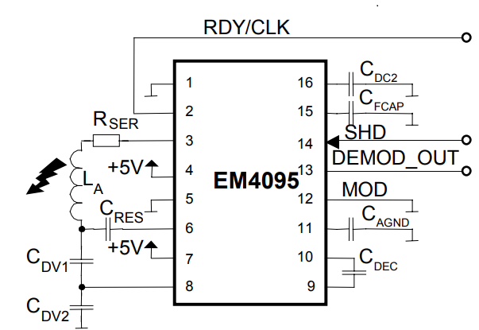

```{r, include = FALSE}
knitr::opts_chunk$set(
  collapse = TRUE,
  comment = "#>"
)
```

```{r setup, include = FALSE}
library(ant125)
```

# Introduction

Le package **ant125** présente un ensemble de fonctions pour faciliter la conception des antennes de lecteurs RFID 125kHz. Il permet d'estimer les paramètres de ces antennes sur la base d'analyses faites sur de simples relevés de mesures. Les principaux paramètres recherchés lors de la conception d'antenne RFID sont: 
````
 -le nombre de spires
 -l'inductance
 -la résistance
````


Le parckage **ant125** permet aussi de prévoir des pramètres tels que le courant et la tension d'antenne. 

La conception du package s'appuie sur un ensemble d'observation faites sur des antennes RFID 125khz ainsi que sur la théorique des circuits RLC. A cela s'ajoute une expérience de la technologie RFID qui s'étend sur plusieurs années de travaux. 

Le mode de conception traité par le package **ant125** s'appuie sur le tranceiver EM4095 de EM Microelectronic, un composant dédié au pilotage d'antenne de lecteur de badges 125kHz.

# Théorie

Pour lire un badge RFID, il est nécessaire de l'activer par un champ magnétique sinusoïdale de fréquence 125kHz. Ce champ est produit par une antenne composée d'une multitudes de spires. Une fois activé, le badge va moduler cette porteuse activatrice afin de transmettre un numéro d'identification selon un protocole propre aux caractéristiques de la puce contenue dans le badge. La modulation peut être d'amplitude ou de fréquence.\\
Ce principe simple laisse entendre que la qualité de la lecture de badge va reposer sur la qualité du champ magnétique activateur. On comprend alors le soin apporté à la conception de l'antenne du lecteur.\\
La production de la porteuse à la fréquence de 125kHz repose sur un circuit RLC conçu pour une fréquence de résonnance de 125kHz.La théorie de ces circuit nous apprend que cette fréquence de résonnance dépend de la valeur de l'inductance d'antenne ainsi que de la valeur du condensateur d'accord. La fréquence de résonnance est donnée par la célébre relation:

  $$F = \frac{1}{2 \pi \sqrt{LC}}$$
 

où L est l'inductance de l'antenne et C la capacité d'accord associée.


La tension d'antenne est liée au factuer de qualité du système, lequel est défini de la façon suivante:


$$Q = \frac{2\pi F L}{R}$$
où F est la fréquence et R la résistance d'antennne

# Présentation du tranceiver EM4095

Le transceiver EM4095 est le circuit qui pilote l'antenne et qui se charge de la démodulation.

## schéma de principe


\newpage

Dans ce schéma, il faut noter:
````
- l'antenne La
- la capacité d'accord CRES
- le diviseur capacitif constitué de Cdv1 et Cdv2

````
Ces éléments entrerons dans l'estimation de l'antenne présentée plus loin.

Sur la base de ce schéma, on établit que le courant d'antenne est défini selon la relation suivante:


La tension d'antenne est donnée par la relation suivante: 


# Présentation des fonctions

Le package **ant125** contient deux types de fonctions:
````
- les fonctions de calcul des estimateurs de paramètres
- les fonctions de représentation des données
````


# Recueil de mesures
